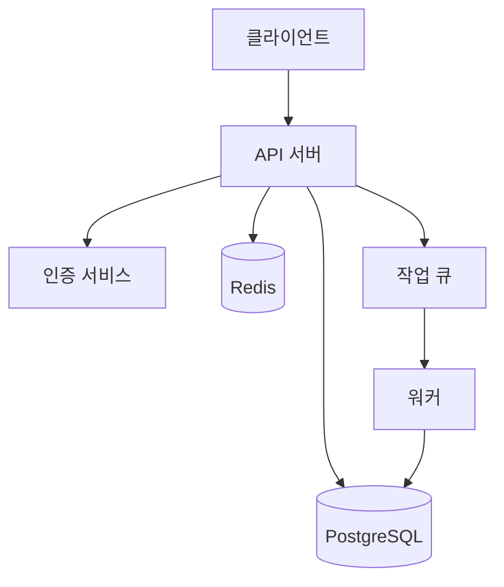

# 플레이북 09: AI 문서 자동화

> AI를 활용해 README, API 문서, 아키텍처 다이어그램을 빠르게 생성하는 가이드

## 언제 쓰나요?

- 새 프로젝트를 시작했는데 README가 비어있을 때
- API 엔드포인트가 늘어났는데 문서가 안 따라갈 때
- 온보딩용 아키텍처 문서가 필요할 때
- 레거시 프로젝트의 문서를 한번에 정리하고 싶을 때

## 소요 시간

10-20분

## 사전 준비

- 문서화할 프로젝트 소스 코드
- Claude Code 또는 AI 코딩 도구 설치
- (선택) Docusaurus, MkDocs 등 문서 프레임워크

## Step 1: README 자동 생성

프로젝트 루트에서 AI에게 전체 구조를 분석하게 하면, 일관된 README를 만들 수 있어요.

```bash
# 프로젝트 구조를 분석해서 README 생성
claude "이 프로젝트의 README.md를 작성해줘.
포함할 내용:
- 프로젝트 설명 (한 줄 요약 + 상세)
- 설치 방법
- 사용 예제 (코드 포함)
- 환경 변수 목록
- 디렉토리 구조
package.json과 src/ 디렉토리를 참고해줘"

# 기존 README 업데이트
claude "현재 README.md를 읽고, 실제 코드와 비교해서
빠진 기능이나 변경된 API를 반영해서 업데이트해줘"
```

| 요소 | 프롬프트 팁 |
|------|------------|
| 설치 방법 | `package.json`의 scripts와 dependencies 참조 지시 |
| 사용 예제 | "실제 실행 가능한 코드"로 명시 |
| 환경 변수 | `.env.example` 파일 참조 지시 |
| 배지 | CI 상태, 라이선스, 버전 배지 추가 요청 |

## Step 2: API 문서 자동 생성

API 엔드포인트가 많아지면 수작업 문서화는 현실적으로 어렵습니다. 코드에서 직접 추출하는 게 정확해요.

```bash
# Express/FastAPI 라우트에서 API 문서 생성
claude "src/routes/ 디렉토리의 모든 라우트 파일을 분석해서
OpenAPI 3.0 형식의 API 문서를 만들어줘.
각 엔드포인트별로:
- HTTP 메서드와 경로
- 요청 파라미터 (query, body, path)
- 응답 스키마 (성공/에러)
- 인증 필요 여부
를 포함해줘"

# TypeScript 타입에서 문서 추출
claude "src/types/ 디렉토리의 인터페이스를 분석해서
각 타입의 용도와 필드 설명을 표 형식으로 정리해줘"
```

```typescript
// 코드에 JSDoc을 추가하면 문서 품질이 올라갑니다
/**
 * 사용자 프로필을 조회합니다
 * @param userId - 조회할 사용자 ID
 * @returns 사용자 프로필 정보
 * @throws {NotFoundError} 사용자가 존재하지 않을 때
 */
async function getProfile(userId: string): Promise<UserProfile> {
  // ...
}
```

## Step 3: 아키텍처 다이어그램 생성

코드 구조를 Mermaid 다이어그램으로 시각화하면 온보딩 시간을 크게 줄일 수 있어요.

```bash
# 프로젝트 아키텍처를 Mermaid 다이어그램으로
claude "이 프로젝트의 아키텍처를 Mermaid 다이어그램으로 그려줘.
- 서비스 간 통신 흐름 (flowchart)
- 데이터베이스 ERD (erDiagram)
- 배포 파이프라인 (sequenceDiagram)
src/ 디렉토리 구조와 docker-compose.yml을 참고해줘"
```



| 다이어그램 종류 | 용도 | Mermaid 타입 |
|----------------|------|-------------|
| 시스템 아키텍처 | 전체 구조 파악 | `flowchart` |
| 데이터 모델 | DB 스키마 이해 | `erDiagram` |
| API 흐름 | 요청/응답 순서 | `sequenceDiagram` |
| 상태 전이 | 비즈니스 로직 | `stateDiagram-v2` |

## Step 4: CI/CD로 문서 자동 업데이트

문서를 한번 만들고 끝이 아니라, 코드가 바뀔 때마다 자동으로 업데이트되게 설정하세요.

```yaml
# .github/workflows/docs-update.yml
name: Auto-update docs
on:
  push:
    branches: [main]
    paths: ['src/**', 'package.json']

jobs:
  update-docs:
    runs-on: ubuntu-latest
    steps:
      - uses: actions/checkout@v4
      - name: Generate API docs
        run: npx typedoc --out docs/api src/
      - name: Check for changes
        run: |
          git diff --quiet docs/ || echo "DOCS_CHANGED=true" >> $GITHUB_ENV
      - name: Commit updated docs
        if: env.DOCS_CHANGED == 'true'
        run: |
          git config user.name "github-actions"
          git config user.email "actions@github.com"
          git add docs/
          git commit -m "docs: auto-update API documentation"
          git push
```

## Step 5: 문서 품질 검증

생성된 문서가 실제로 유용한지 확인하는 체크리스트예요.

```bash
# AI로 문서 품질 검증
claude "docs/ 디렉토리의 문서를 검토해줘.
체크 항목:
1. 코드 예제가 실제로 실행 가능한지
2. 링크가 깨지지 않았는지
3. 최신 API와 일치하는지
4. 설치 방법이 정확한지
문제가 있으면 수정 사항을 알려줘"
```

## 체크리스트

- [ ] README에 프로젝트 설명, 설치, 사용법이 포함됐는지
- [ ] API 엔드포인트별 요청/응답 스키마가 문서화됐는지
- [ ] 아키텍처 다이어그램이 현재 코드와 일치하는지
- [ ] 환경 변수 목록이 `.env.example`과 동기화됐는지
- [ ] CI에서 문서 자동 업데이트가 설정됐는지

## 실용적인 팁

| 상황 | 접근 방법 |
|------|----------|
| 레거시 프로젝트 | 먼저 디렉토리 구조 분석 → 전체 개요 문서부터 |
| 마이크로서비스 | 서비스별 README + 전체 아키텍처 문서 분리 |
| 오픈소스 | CONTRIBUTING.md, CODE_OF_CONDUCT.md도 함께 생성 |
| 사내 도구 | 온보딩 가이드 + FAQ 형식이 효과적 |

## 다음 단계

→ [AI 코드 리뷰 플레이북](./10-code-review.md)

---

**더 자세한 가이드:** [claude-code/playbooks](../playbooks/)

**뉴스레터:** [maily.so/tenbuilder](https://maily.so/tenbuilder)
